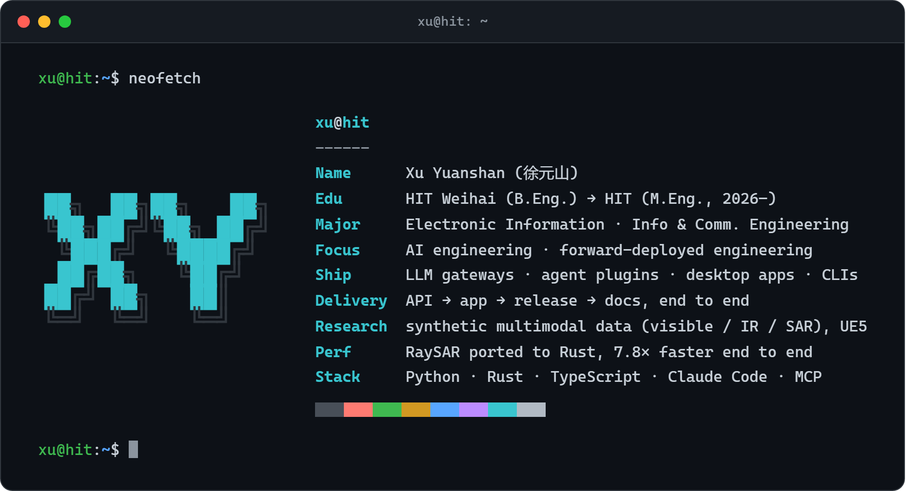

`$ whoami` Xu Yuanshan (徐元山), M.Eng. student at Harbin Institute of Technology. AI engineering and forward-deployed engineering: I ship LLM gateways, agent plugins and desktop apps end to end. Research: synthetic multimodal data (visible / IR / SAR) in UE5. Stack: Python, Rust, TypeScript.

**Now:** [otty-rs](https://github.com/BeiZi6/otty-rs) — [otty-rs 怎么分层](https://blog.xyucode.top/p/2026-10-06-otty-rs-怎么分层)
