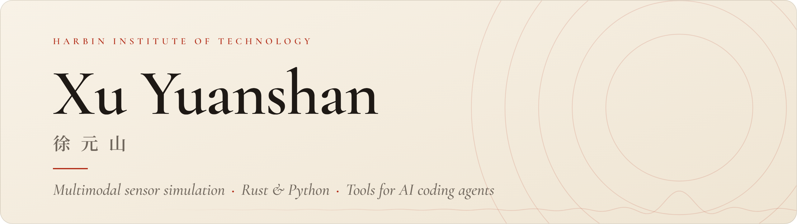

<picture>
  <source media="(prefers-color-scheme: dark)" srcset="assets/banner-dark.png">
  
</picture>

Master's student at Harbin Institute of Technology, working on multimodal sensor simulation. I also build tools and plugins for AI coding agents such as Claude Code and DeepSeek Harness.

### Research

- **Visible / infrared / SAR simulation in Unreal Engine 5.** One capture produces a visible image, an 8–14 μm infrared radiance image and a SAR image of the same scene.
- **raysar-rust** *(private)*. A Rust port of the RaySAR SAR simulator that replaces its POV-Ray tracer and MATLAB image formation. Matches the official MATLAB imaging to within 6×10⁻¹⁶ of peak and cuts end-to-end SAR generation from 79.9 s to 10.2 s.

### Tech stack

<picture>
  <source media="(prefers-color-scheme: dark)" srcset="assets/stack-dark.svg">
  
</picture>

### Education

- **Harbin Institute of Technology**, M.Eng. in Electronic Information (Information and Communication Engineering), 2026 – present
- **Harbin Institute of Technology, Weihai**, B.Eng. in Electronic Information Engineering
